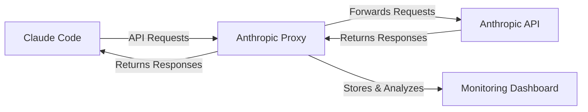

# Anthropic API Proxy

A professional proxy server for forwarding requests to the Anthropic API, specifically designed for Claude Code with comprehensive monitoring capabilities.

**[🇨🇳 中文文档](docs/README_CN.md)** | **[📁 GitHub Repository](https://github.com/kingoliang/anthropic-proxy)**

## 🎯 Purpose and Overview

### What is this project?
This project provides a **local proxy server** that sits between Claude Code and the Anthropic API, acting as an intelligent middleware layer that enhances your development experience with Claude.

### Why do you need it?
When using Claude Code, you typically send requests directly to Anthropic's servers. While this works perfectly, you miss out on valuable insights about your API usage. This proxy server solves that by providing:

🔍 **Complete Request Visibility**: See every API call made by Claude Code, including full request/response data, token usage, and timing metrics.

📊 **Usage Analytics**: Track your API consumption patterns, model usage, success rates, and performance metrics over time.

🐛 **Debugging Support**: Inspect failed requests, analyze response times, and troubleshoot API integration issues with detailed logging.

💰 **Cost Monitoring**: Monitor token usage and estimate API costs to better manage your Claude Code usage.

📈 **Performance Optimization**: Identify slow requests, optimize your prompts, and improve overall workflow efficiency.

### How does it work?


1. **Transparent Proxying**: Claude Code sends requests to your local proxy instead of directly to Anthropic
2. **Request Interception**: The proxy captures all request/response data for analysis
3. **API Forwarding**: Requests are forwarded to Anthropic API without modification
4. **Real-time Monitoring**: All interactions are logged and analyzed in a web dashboard
5. **Data Export**: Export usage data for further analysis or reporting

### Who should use this?
- **Claude Code Power Users**: Developers who want to optimize their AI-assisted workflows
- **API Cost Conscious Users**: Those who need to monitor and control their API spending
- **Development Teams**: Teams that need visibility into AI tool usage across projects
- **API Integration Developers**: Developers building applications with Anthropic API
- **Performance Analysts**: Users who want to analyze and optimize their prompt efficiency

### Key Benefits
✅ **Zero Code Changes**: Works with existing Claude Code installation - just set one environment variable  
✅ **Real-time Insights**: Live dashboard with immediate feedback on API usage  
✅ **Privacy Focused**: All data stays on your local machine  
✅ **Production Ready**: Includes Docker, PM2, and deployment configurations  
✅ **Export Capabilities**: Get your data out in standard formats for further analysis

## 📁 Project Structure

```
anthropic-proxy/
├── src/                    # Source code
│   ├── server.js          # Main server application
│   ├── monitor/           # Monitoring modules
│   │   ├── store.js       # Request/response data storage
│   │   └── ui.js          # Web monitoring interface
│   └── utils/             # Utility functions
├── docs/                  # Documentation
├── examples/              # Configuration examples
│   ├── Dockerfile         # Docker container setup
│   ├── docker-compose.yml # Docker Compose configuration
│   └── pm2.config.js      # PM2 process management
├── package.json
├── README.md
├── .env.example           # Environment variables template
├── .gitignore
└── LICENSE
```

## ✨ Features

- 🚀 **Node.js-based proxy** for Anthropic API
- 📊 **Built-in monitoring dashboard** with real-time updates
- 🔒 **API key masking** for security
- 📈 **Performance metrics** and token usage tracking
- 🌊 **Streaming response** support with chunk analysis
- 💾 **Data export** and management capabilities
- 🐳 **Docker support** with examples
- ⚡ **Production ready** with PM2 configuration

## 🚀 Quick Start

### Option 1: Run directly from GitHub (Recommended)
```bash
# Run immediately without cloning
npx github:kingoliang/anthropic-proxy

# Or with custom configuration
PORT=3000 LOG_LEVEL=DEBUG npx github:kingoliang/anthropic-proxy
```

### Option 2: Clone and run locally
```bash
# Clone the repository
git clone https://github.com/kingoliang/anthropic-proxy.git
cd anthropic-proxy

# Install dependencies
npm install

# Configure environment (optional)
cp .env.example .env
# Edit .env file with your settings

# Run the server
npm start
# or
npx .
```

### Option 3: Global installation
```bash
# Install globally from GitHub
npm install -g github:kingoliang/anthropic-proxy

# Run anywhere
anthropic-proxy

# Or with environment variables
PORT=3000 LOG_LEVEL=DEBUG anthropic-proxy
```

### Option 4: Development mode
```bash
# Clone and link for development
git clone https://github.com/kingoliang/anthropic-proxy.git
cd anthropic-proxy
npm install
npm link

# Run from anywhere
anthropic-proxy
```

## Environment Configuration

Create a `.env` file or set environment variables:

```bash
# Server configuration
HOST=0.0.0.0
PORT=8082

# Request timeout (milliseconds)
REQUEST_TIMEOUT=120000

# Log level
LOG_LEVEL=INFO
```

## Usage Examples

```bash
# Run with custom port
PORT=3000 npx .

# Run in debug mode
LOG_LEVEL=DEBUG npx .

# Combine multiple environment variables
PORT=3000 LOG_LEVEL=DEBUG npx .
```

## API Endpoints

### Proxy Endpoints
- `POST /v1/messages` - Main messages endpoint (supports streaming)
- `POST /v1/messages/count_tokens` - Token counting endpoint
- `GET /health` - Health check
- `GET /` - API information

### Monitoring Endpoints
- `GET /monitor` - Web monitoring dashboard
- `GET /api/monitor/requests` - Get request list with filtering
- `GET /api/monitor/stats` - Get real-time statistics (supports filter parameters)
- `GET /api/monitor/stream` - Server-sent events for real-time updates
- `POST /api/monitor/clear` - Clear all monitoring data
- `GET /api/monitor/export` - Export monitoring data as JSON (supports filter parameters)
- `GET /api/monitor/analyze` - Generate analysis report (supports filter parameters)

## Monitoring Dashboard

Access the built-in monitoring interface at: `http://localhost:8082/monitor`

### Features:
- **Real-time request/response tracking**
- **Performance metrics dashboard** - dynamically updates based on filter conditions
- **Stream chunk timeline visualization**
- **API key masking** for security
- **Smart filtering system** (status, model, time range)
  - Filter conditions apply to all functions (statistics, export, analysis)
  - Model list always shows all available models, unaffected by filtering
- **Data export capabilities** - supports exporting filtered data
- **Compressed export** - uses incremental deduplication algorithm to reduce file size
- **Analysis reports** - generates detailed analysis based on filter conditions
- **Auto-refresh with SSE**

### Dashboard Sections:
1. **Smart Statistics Panel** - Real-time statistics that update based on filter conditions
2. **Advanced Filters** - Multi-dimensional filtering by status, model, and time range
3. **Request List** - Filterable table of API calls with real-time updates
4. **Detail View** - Complete request/response inspection
5. **Stream Analysis** - Chunk-by-chunk streaming visualization
6. **Export Tools** - JSON data export with filtering support
7. **Analysis Reports** - Comprehensive analysis based on filtered data

## Security Notes

- API keys are automatically masked in logs and monitoring interface
- Shows first 10 characters + "..." + last 4 characters
- No authentication required for monitoring (local use)
- Sensitive headers are filtered in request logging

## Requirements

- **Node.js 18+**
- **API Key**: Client must provide API key via headers (`x-api-key` or `authorization`)
- **Network**: Outbound access to Anthropic API

## 🎯 Using with Claude Code

Once the proxy server is running, configure Claude Code to use it:

### Step 1: Start the Proxy Server
```bash
# Start on default port 8082
npx github:kingoliang/anthropic-proxy

# Or start on custom port (e.g., 3000)
PORT=3000 npx github:kingoliang/anthropic-proxy
```

### Step 2: Configure Claude Code Environment
Set the environment variable to point Claude Code to your proxy:

```bash
# For default port 8082
export ANTHROPIC_BASE_URL=http://localhost:8082

# For custom port (e.g., 3000)
export ANTHROPIC_BASE_URL=http://localhost:3000
```

### Step 3: Start Claude Code
```bash
# Claude Code will now use your proxy server
claude
```

### Alternative Configuration Methods

**Option 1: Inline environment variable**
```bash
ANTHROPIC_BASE_URL=http://localhost:8082 claude
```

**Option 2: Add to your shell profile**
```bash
# Add to ~/.bashrc, ~/.zshrc, or ~/.profile
echo 'export ANTHROPIC_BASE_URL=http://localhost:8082' >> ~/.bashrc
source ~/.bashrc
```

**Option 3: Create a startup script**
```bash
#!/bin/bash
# start-claude-with-proxy.sh
export ANTHROPIC_BASE_URL=http://localhost:8082
claude
```

### Verification
1. **Check proxy is running**: Visit `http://localhost:8082/monitor`
2. **Test Claude Code**: Make any request in Claude Code
3. **Monitor requests**: Watch real-time requests in the monitoring dashboard

## Technical Details

- **Framework**: Express.js with ES modules
- **Monitoring**: In-memory storage with circular buffer (max 1000 requests)
- **Real-time Updates**: Server-Sent Events (SSE)
- **Stream Processing**: Full chunk tracking and content merging
- **Error Handling**: Comprehensive error catching and logging

## 🐳 Production Deployment

### Docker
```bash
# Build and run with Docker
docker build -t anthropic-proxy .
docker run -p 8082:8082  anthropic-proxy

# Or use Docker Compose
docker-compose -f examples/docker-compose.yml up
```

### PM2 (Process Manager)
```bash
# Install PM2
npm install -g pm2

# Start with PM2
pm2 start examples/pm2.config.js

# Monitor
pm2 monit

# Stop
pm2 stop anthropic-proxy
```

### Systemd Service
```bash
# Create service file
sudo nano /etc/systemd/system/anthropic-proxy.service

# Add service configuration
[Unit]
Description=Anthropic API Proxy
After=network.target

[Service]
Type=simple
User=nodejs
WorkingDirectory=/path/to/anthropic-proxy
ExecStart=/usr/bin/node src/server.js
Restart=always
Environment=NODE_ENV=production
Environment=PORT=8082

[Install]
WantedBy=multi-user.target

# Enable and start
sudo systemctl enable anthropic-proxy
sudo systemctl start anthropic-proxy
```

## 🔧 Troubleshooting

### Common Issues:

1. **Port already in use**: Change PORT environment variable
2. **API key not working**: Verify key format and headers
3. **Timeout errors**: Increase REQUEST_TIMEOUT value
4. **Memory usage**: Monitoring data auto-rotates after 1000 requests
5. **Module not found**: Ensure you're running from the correct directory

### Debug Mode:
```bash
LOG_LEVEL=DEBUG npx github:kingoliang/anthropic-proxy
```

### Health Check:
```bash
curl http://localhost:8082/health
```

## 🔗 Related Links

- **GitHub Repository**: https://github.com/kingoliang/anthropic-proxy
- **NPM Package**: `npx github:kingoliang/anthropic-proxy`
- **Anthropic API Documentation**: https://docs.anthropic.com/
- **Docker Hub**: (coming soon)

## 🤝 Contributing

This proxy server is designed for development and testing purposes. Contributions are welcome:

1. Fork the repository
2. Create a feature branch
3. Make your changes
4. Add tests if applicable
5. Submit a pull request

## 📄 License

MIT License - see [LICENSE](LICENSE) for details.

## 🙏 Acknowledgments

- Built with [Express.js](https://expressjs.com/)
- Monitoring UI powered by [Alpine.js](https://alpinejs.dev/) and [Tailwind CSS](https://tailwindcss.com/)
- Generated with assistance from [Claude Code](https://claude.ai/code)