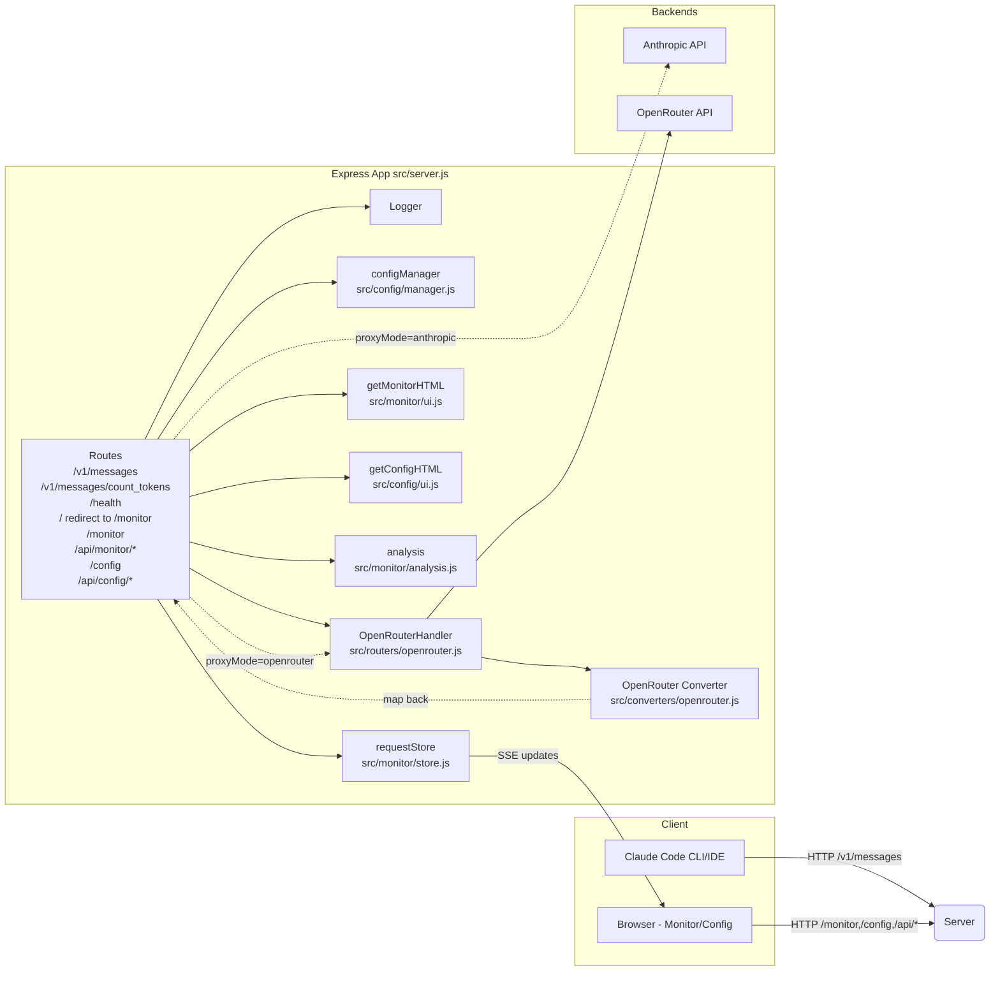
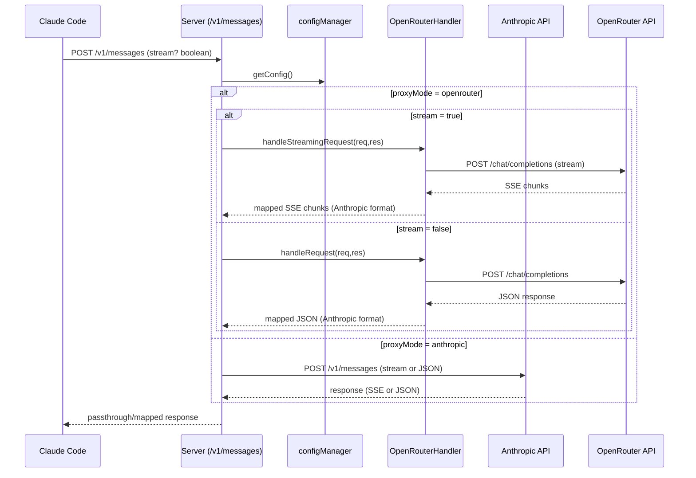
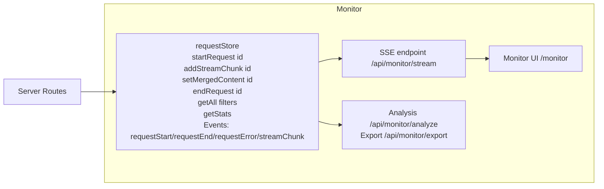
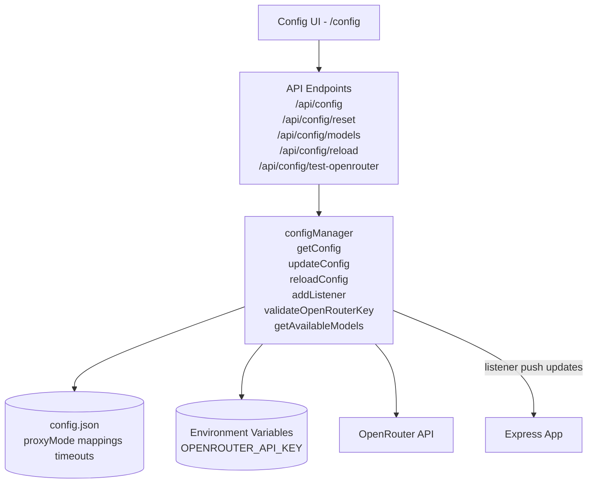

# 系统架构文档

## 系统概览
- Node.js/Express 服务器，支持 Anthropic 直连与 OpenRouter 模式的动态切换
- 监控子系统：请求追踪、SSE 实时更新、统计与分析、数据导出
- 配置子系统：Web 配置 UI、运行时配置生效、模型列表动态加载、环境变量优先

## 模块分层与交互

## 请求路径与路由逻辑

## 监控与实时更新

## 配置子系统与动态生效

## 关键端点清单
- 代理：`POST /v1/messages`, `POST /v1/messages/count_tokens`, `GET /health`, `GET /`
- 监控：`GET /monitor`, `GET /api/monitor/requests`, `GET /api/monitor/requests/:id`, `GET /api/monitor/stats`, `GET /api/monitor/stream`, `POST /api/monitor/clear`, `GET /api/monitor/export`, `GET /api/monitor/analyze`, `GET /api/monitor/config`
- 配置：`GET /config`, `GET/POST /api/config`, `POST /api/config/reset`, `POST /api/config/test-openrouter`, `GET /api/config/models`, `POST /api/config/reload`

## 安全与合规
- API 密钥仅从环境变量读取并在 UI/日志中掩码
- config.json 仅包含非敏感设置与映射
- 监控面板用于本地开发，SSE 实时更新，不含敏感数据内容泄露

## 可扩展点
- 在 `converters/` 中增加新的提供商映射器
- 在 `routers/` 添加新的后端路由处理器
- `requestStore` 存储后端可替换为持久化存储
- 配置 UI 增加更多动态校验与模型元数据展示
