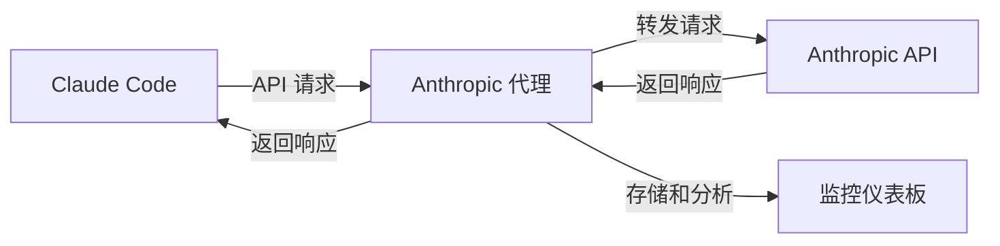

# Anthropic API 代理服务器

专为 Claude Code 设计的智能代理服务器，支持**双模式路由**：直接透传到 Anthropic API 或智能转换到 OpenRouter API，同时提供全面的监控与分析功能。

**[🇺🇸 English Documentation](../README.md)** | **[📁 GitHub 仓库](https://github.com/kingoliang/anthropic-proxy)**

## 🎯 项目目的与概述

### 这个项目是什么？
本项目提供了一个**本地代理服务器**，作为 Claude Code 和 Anthropic API 之间的智能中间层，增强您使用 Claude 的开发体验。

### 为什么需要它？
当您使用 Claude Code 时，通常会直接向 Anthropic 的服务器发送请求。虽然这样运行完美，但您会错过对 API 使用情况的宝贵洞察。这个代理服务器通过以下功能解决了这个问题：

- 🔍 **完整的请求可视化**：查看每个 API 调用，包括完整请求/响应、token 使用与耗时指标
- 📊 **使用分析**：跟踪消费模式、模型使用、成功率与性能指标
- 🐛 **调试支持**：检查失败请求、分析响应时间，依靠详细日志排查问题
- 💰 **成本监控**：监控 token 使用并估算成本
- 📈 **性能优化**：识别慢请求与优化提示

### 它是如何工作的？


1. **透明代理**：Claude Code 指向本地代理而不是直接访问 Anthropic
2. **请求拦截**：代理捕获所有请求/响应数据用于分析
3. **API 转发**：请求按原格式转发到 Anthropic API
4. **实时监控**：所有交互在 Web 仪表板中记录与分析
5. **数据导出**：导出使用数据进行进一步分析或报告

### 谁应该使用它？
- **Claude Code 高级用户**：希望优化 AI 辅助工作流的开发者
- **API 成本敏感用户**：需要监控与控制 API 支出的用户
- **开发团队**：需要了解项目中 AI 工具使用情况的团队
- **API 集成开发者**：基于 Anthropic API 构建应用的开发者
- **性能分析师**：希望分析与优化提示效率的用户

## ✨ 功能特性

- 🚀 **基于 Node.js** 的 Anthropic API 代理
- 🔀 **双重路由模式**：直连 Anthropic API 或经由 OpenRouter 自动格式转换
- 🛠 **高级配置界面** `/config` 实时更新
  - 可切换代理模式（Anthropic/OpenRouter）
  - 简化的 3 模型族映射（Sonnet/Opus/Haiku）
  - OpenRouter 动态模型加载与 1 小时缓存
  - HTML5 数据列表可搜索模型选择与过滤
  - 所有用户操作的 Toast 通知
  - 监控与配置页面间的导航链接
- 🔄 **配置实时生效** - 所有更改立即生效，无需重启
- 🔐 **安全 API 密钥管理** - 仅通过环境变量
- 📊 **全面监控仪表板** - 实时 SSE 更新
- 🔍 **增强日志记录** - Anthropic 和 OpenRouter 模式的详细日志
- 🔒 **API 密钥掩码** - 日志与 UI 安全保护
- 📈 **性能指标** 与可过滤的 token 使用跟踪
- 🌊 **完整流式支持** - 逐块分析
- 💾 **智能数据导出** - 压缩导出与过滤功能
- 🐳 **Docker 支持** - 生产环境示例
- ⚡ **生产就绪** - PM2 和 systemd 配置

## 📁 项目结构

```
anthropic-proxy/
├── src/                    # 源代码
│   ├── server.js          # 主服务器应用
│   ├── monitor/           # 监控模块
│   │   ├── store.js       # 请求/响应存储
│   │   └── ui.js          # Web 监控界面
│   └── utils/             # 工具函数
├── docs/                  # 文档
├── examples/              # 配置示例
│   ├── Dockerfile         # Docker 容器设置
│   ├── docker-compose.yml # Docker Compose 配置
│   └── pm2.config.js      # PM2 进程管理
├── package.json
├── README.md
├── .env.example           # 环境变量模板
├── .gitignore
└── LICENSE
```

## 🔀 两种核心功能模式

### 功能一：直连 Anthropic API（默认模式）
**作用**：作为透明代理，原样转发 Claude Code 请求到 Anthropic API，提供完整监控

**使用方法**：
1. 启动代理服务器：
   ```bash
   npx github:kingoliang/anthropic-proxy
   ```
2. 配置 Claude Code 使用代理：
   ```bash
   export ANTHROPIC_BASE_URL=http://localhost:8082
   ```
3. 继续使用 Claude Code，Anthropic API 密钥通过请求头传递（x-api-key 或 authorization）
4. 在 `http://localhost:8082/monitor` 实时监控所有请求

**一键启动示例**：
```bash
ANTHROPIC_BASE_URL=http://localhost:8082 claude
```

**优势**：
- ✅ 零代码更改，完全兼容现有 Claude Code 设置
- ✅ 保持原生 Anthropic API 体验
- ✅ 完整请求/响应监控与分析
- ✅ 支持所有 Anthropic 模型和功能

### 功能二：转换 Anthropic API 格式到 OpenRouter API
**作用**：将 Claude Code 发出的 Anthropic API 请求智能转换为 OpenRouter 格式，让您使用更便宜的第三方模型

**使用方法**：
1. 设置 OpenRouter API 密钥：
   ```bash
   export OPENROUTER_API_KEY=sk-or-v1-your_key_here
   ```
2. 启动代理服务器：
   ```bash
   npx github:kingoliang/anthropic-proxy
   ```
3. 打开配置界面切换模式：
   ```bash
   open http://localhost:8082/config
   ```
4. 在 Web 界面选择「OpenRouter」模式
5. 配置模型映射（可选）：
   - Sonnet → 选择一个 OpenRouter 模型
   - Opus → 选择一个 OpenRouter 模型  
   - Haiku → 选择一个 OpenRouter 模型
6. 保存配置，继续正常使用 Claude Code

**完整示例**：
```bash
# 1. 设置环境变量
export OPENROUTER_API_KEY=sk-or-v1-your_key_here
export ANTHROPIC_BASE_URL=http://localhost:8082

# 2. 启动代理
npx github:kingoliang/anthropic-proxy

# 3. 在浏览器中访问 http://localhost:8082/config 切换到 OpenRouter 模式

# 4. 使用 Claude Code（会自动使用 OpenRouter 的模型）
claude
```

**优势**：
- 💰 **成本节约**：使用 OpenRouter 更便宜的第三方模型
- 🔄 **自动转换**：请求/响应格式自动转换，Claude Code 无感知
- 🌐 **更多选择**：99+ 模型可选，包括各种开源和商业模型
- 📊 **完整监控**：转换过程透明，可查看原始请求和转换后的 OpenRouter 请求

## 🚀 快速开始

### 方式 1：直接从 GitHub 运行（推荐）
```bash
# 无需克隆即可立即运行
npx github:kingoliang/anthropic-proxy

# 或使用自定义配置
PORT=3000 LOG_LEVEL=DEBUG npx github:kingoliang/anthropic-proxy
```

### 方式 2：克隆到本地运行
```bash
# 克隆仓库
git clone https://github.com/kingoliang/anthropic-proxy.git
cd anthropic-proxy

# 安装依赖
npm install

# 配置环境变量（可选）
cp .env.example .env
# 编辑 .env 设置你的配置

# 启动服务器
npm start
# 或
npx .
```

### 方式 3：全局安装
```bash
# 从 GitHub 全局安装
npm install -g github:kingoliang/anthropic-proxy

# 在任意目录运行
anthropic-proxy

# 使用环境变量
PORT=3000 LOG_LEVEL=DEBUG anthropic-proxy
```

### 方式 4：开发模式
```bash
# 克隆并链接用于开发
git clone https://github.com/kingoliang/anthropic-proxy.git
cd anthropic-proxy
npm install
npm link

# 随处运行
anthropic-proxy
```

## 环境变量配置

创建 `.env` 文件或设置环境变量：

```bash
# 服务器配置
HOST=0.0.0.0
PORT=8082

# API 基础 URL
ANTHROPIC_BASE_URL=https://api.anthropic.com

# 请求超时（毫秒）
REQUEST_TIMEOUT=120000

# 日志级别
LOG_LEVEL=INFO

# OpenRouter 配置（OpenRouter 模式必需）
OPENROUTER_API_KEY=your_openrouter_api_key_here
```

### 配置实时生效

配置更改**无需重启**即可立即生效：

- **代理模式**：通过 Web UI 在 Anthropic/OpenRouter 间瞬时切换
- **模型映射**：更新 3 族映射（Sonnet/Opus/Haiku），新请求立即应用
- **模型列表**：OpenRouter API 动态加载，1 小时智能缓存
- **API 密钥**：每次请求从环境变量读取，确保最大安全性
- **手动重载**：调用 `POST /api/config/reload` 强制刷新配置和环境
- **UI 反馈**：Toast 通知确认所有配置更改


## 使用示例

```bash
# 使用自定义端口运行
PORT=3000 npx github:kingoliang/anthropic-proxy

# 使用调试模式运行
LOG_LEVEL=DEBUG npx github:kingoliang/anthropic-proxy

# 同时设置多个环境变量
PORT=3000 LOG_LEVEL=DEBUG npx github:kingoliang/anthropic-proxy
```

## API 端点

### 代理端点
- `POST /v1/messages` - 主消息端点（支持流式响应）
- `POST /v1/messages/count_tokens` - Token 计数端点
- `GET /health` - 健康检查
- `GET /` - 重定向到监控界面

### 监控端点
- `GET /monitor` - Web 监控仪表板
- `GET /api/monitor/requests` - 获取带过滤的请求列表
- `GET /api/monitor/requests/:id` - 根据 ID 获取单个请求
- `GET /api/monitor/stats` - 获取实时统计（支持筛选参数）
- `GET /api/monitor/stream` - 服务器发送事件（SSE）实时更新
- `POST /api/monitor/clear` - 清空所有监控数据
- `GET /api/monitor/export` - 导出监控数据为 JSON（支持筛选参数）
- `GET /api/monitor/analyze` - 生成分析报告（支持筛选参数）
- `GET /api/monitor/config` - 获取服务器信息（logLevel、port、host）

### 配置端点
- `GET /config` - 高级配置界面，可搜索模型选择
- `GET /api/config` - 获取当前配置，集成实时环境
- `POST /api/config` - 更新并持久化配置，立即生效
- `POST /api/config/reset` - 重置为默认配置，带确认提示
- `POST /api/config/test-openrouter` - 从环境验证 OpenRouter API Key
- `GET /api/config/models` - 列出可用 OpenRouter 模型（1小时智能缓存）
- `POST /api/config/reload` - 强制重新加载配置和环境变量

## 监控仪表板

访问：`http://localhost:8082/monitor`

- **实时请求/响应跟踪** - 支持 Anthropic 和 OpenRouter 双模式
- **性能指标仪表板** - 按筛选条件动态更新
- **流分块时间线可视化** - 详细时序分析
- **双模式日志记录** - 两种代理模式的全面日志与原始响应数据
- **API 密钥掩码** - 安全保护（仅环境变量）
- **智能筛选系统** - 状态、模型、时间范围、提供商
  - 筛选条件应用于统计、导出、分析等所有功能
  - 模型列表显示两个提供商的所有可用模型
- **高级数据导出** - 带压缩导出选项的筛选数据
- **详细分析报告** - 提供商特定的洞察和性能指标
- **SSE 自动刷新** - 无需页面重载的实时更新
- **提供商透明度** - 清晰显示使用了哪个 API 后端

### 仪表板模块
1. 智能统计面板
2. 高级筛选器（状态/模型/时间范围）
3. 请求列表（可筛选、实时刷新）
4. 详情视图（完整请求/响应检查）
5. 流分析（逐块流式可视化）
6. 导出工具（支持筛选）
7. 分析报告（基于筛选数据）

## 安全说明

- **API 密钥**：仅存储在环境变量中 - 绝不在配置文件中
- **自动掩码** - 日志和监控界面中（前 10 位 + "..." + 后 4 位）
- **无需认证** - 监控仪表板（设计用于本地开发使用）
- **敏感头过滤** - 请求日志中自动过滤
- **安全提交** - `config.json` 不含机密 - 仅模型映射和设置
- **环境隔离** - 所有敏感数据通过 `.env` 文件（排除版本控制）
- **本地数据** - 所有配置和监控数据保留在你的机器上
- **API 密钥验证** - 实时测试确保使用前密钥有效

## 系统要求

- **Node.js 18+**
- **API 密钥**：
  - Anthropic API 密钥（供 Claude Code 使用）通过请求头（`x-api-key` 或 `authorization`）
  - OpenRouter API 密钥（可选）通过 `OPENROUTER_API_KEY` 环境变量
- **网络**：访问 Anthropic API 和/或 OpenRouter API 的出站权限
- **浏览器**：支持 HTML5 数据列表的现代浏览器，用于配置界面

## 🎯 在 Claude Code 中使用

### 步骤 1：启动代理服务器
```bash
# 默认端口 8082
npx github:kingoliang/anthropic-proxy

# 自定义端口（如 3000）
PORT=3000 npx github:kingoliang/anthropic-proxy
```

### 步骤 2：配置 Claude Code 环境
设置环境变量指向你的代理：

```bash
# 默认端口 8082
export ANTHROPIC_BASE_URL=http://localhost:8082

# 自定义端口（如 3000）
export ANTHROPIC_BASE_URL=http://localhost:3000
```

### 步骤 3：启动 Claude Code
```bash
claude
```

### 其他配置方法

**方法 1：内联环境变量**
```bash
ANTHROPIC_BASE_URL=http://localhost:8082 claude
```

**方法 2：添加到 shell 配置文件**
```bash
echo 'export ANTHROPIC_BASE_URL=http://localhost:8082' >> ~/.bashrc
source ~/.bashrc
```

**方法 3：创建启动脚本**
```bash
#!/bin/bash
# start-claude-with-proxy.sh
export ANTHROPIC_BASE_URL=http://localhost:8082
claude
```

### OpenRouter 模式设置
1. **设置 API Key**：在 `.env` 文件中添加 `OPENROUTER_API_KEY=your_key_here`（必需）
2. **访问配置**：打开 `http://localhost:8082/config`
3. **切换模式**：在 Web 界面选择「OpenRouter」模式
4. **配置模型**：设置 3 族模型映射（Sonnet→模型，Opus→模型，Haiku→模型）
   - 从 99+ 可用 OpenRouter 模型中搜索选择
   - 模型动态获取，1 小时缓存
   - 使用内置过滤的可搜索下拉列表
5. **保存测试**：保存配置并测试连接（Toast 即时反馈）
6. **实时更新**：所有更改立即生效 - 无需重启
7. **监控使用**：在监控仪表板查看详细日志和指标

**工作原理：**
- 请求自动从 Anthropic 格式转换为 OpenAI/OpenRouter 格式
- 响应转换回 Anthropic 格式，完全兼容 Claude Code
- 完整流式支持，逐块处理
- 全面日志显示原始 OpenRouter 响应和转换后输出

## 技术细节

- 框架：Express.js + ES Modules
- 监控：内存存储 + 循环缓冲区（最多 1000 个请求）
- 实时更新：Server-Sent Events (SSE)
- 流处理：完整分块跟踪与内容合并
- 错误处理：全面的错误捕获与日志

## 🐳 部署到生产

### Docker
```bash
docker build -t anthropic-proxy .
docker run -p 8082:8082 anthropic-proxy

# 或使用 Docker Compose
docker-compose -f examples/docker-compose.yml up
```

### PM2（进程管理器）
```bash
npm install -g pm2
pm2 start examples/pm2.config.js
pm2 monit
pm2 stop anthropic-proxy
```

### Systemd 服务
```bash
sudo nano /etc/systemd/system/anthropic-proxy.service

[Unit]
Description=Anthropic API Proxy
After=network.target

[Service]
Type=simple
User=nodejs
WorkingDirectory=/path/to/anthropic-proxy
ExecStart=/usr/bin/node src/server.js
Restart=always
Environment=NODE_ENV=production
Environment=PORT=8082

[Install]
WantedBy=multi-user.target

# 启用并启动
sudo systemctl enable anthropic-proxy
sudo systemctl start anthropic-proxy
```

## 🔧 故障排除

### 常见问题
1. **端口被占用**：修改 `PORT` 环境变量或终止现有进程
2. **API 密钥不生效**：
   - 验证 Claude Code 请求头中的 Anthropic 密钥格式
   - 检查 OpenRouter 密钥在 `.env` 文件中设为 `OPENROUTER_API_KEY`
   - 使用配置页面测试 OpenRouter 连接
3. **OpenRouter 连接失败**：验证 API 密钥和到 openrouter.ai 的网络访问
4. **模型映射问题**：使用配置界面从下拉列表选择有效模型
5. **配置无法保存**：检查文件权限和磁盘空间
6. **超时错误**：为慢模型增大 `REQUEST_TIMEOUT` 值
7. **内存使用**：监控数据在 1000 条后自动轮换
8. **找不到模块**：确认在正确目录运行
9. **Toast 通知不工作**：清除浏览器缓存并重新加载配置页面

### 调试模式
```bash
LOG_LEVEL=DEBUG npx github:kingoliang/anthropic-proxy
```

### 健康检查
```bash
curl http://localhost:8082/health
```

## 🔗 相关链接

- GitHub 仓库: https://github.com/kingoliang/anthropic-proxy
- NPM 包: `npx github:kingoliang/anthropic-proxy`
- Anthropic API 文档: https://docs.anthropic.com/
- Docker Hub: （即将推出）

## 🤝 贡献

此代理服务器专为开发与测试目的设计。欢迎贡献：

1. Fork 仓库
2. 创建功能分支
3. 提交更改
4. 添加测试（如适用）
5. 提交 PR

## 📄 许可证

MIT 许可证 - 详见 [LICENSE](../LICENSE)。

## 🙏 致谢

- 使用 [Express.js](https://expressjs.com/) 构建
- 监控 UI 由 [Alpine.js](https://alpinejs.dev/) 与 [Tailwind CSS](https://tailwindcss.com/) 驱动
- 在 [Claude Code](https://claude.ai/code) 的协助下生成