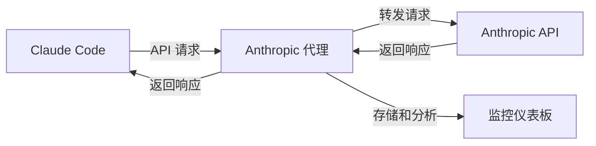

# Anthropic API 代理服务器

专为 Claude Code 设计的专业 Anthropic API 代理服务器，具备全面的监控功能。

**[🇺🇸 English Documentation](../README.md)** | **[📁 GitHub 仓库](https://github.com/kingoliang/anthropic-proxy)**

## 🎯 项目目的与概述

### 这个项目是什么？
本项目提供了一个**本地代理服务器**，作为 Claude Code 和 Anthropic API 之间的智能中间层，增强您使用 Claude 的开发体验。

### 为什么需要它？
当您使用 Claude Code 时，通常会直接向 Anthropic 的服务器发送请求。虽然这样运行完美，但您会错过对 API 使用情况的宝贵洞察。这个代理服务器通过以下功能解决了这个问题：

🔍 **完整的请求可视化**：查看 Claude Code 发起的每个 API 调用，包括完整的请求/响应数据、token 使用量和时间指标。

📊 **使用分析**：追踪您的 API 消费模式、模型使用情况、成功率和性能指标。

🐛 **调试支持**：检查失败的请求，分析响应时间，通过详细日志排查 API 集成问题。

💰 **成本监控**：监控 token 使用量并估算 API 成本，更好地管理您的 Claude Code 使用。

📈 **性能优化**：识别慢请求，优化您的提示，提高整体工作流程效率。

### 它是如何工作的？


1. **透明代理**：Claude Code 向您的本地代理发送请求，而不是直接发送到 Anthropic
2. **请求拦截**：代理捕获所有请求/响应数据用于分析
3. **API 转发**：请求被原样转发到 Anthropic API
4. **实时监控**：所有交互都在 Web 仪表板中被记录和分析
5. **数据导出**：导出使用数据用于进一步分析或报告

### 谁应该使用它？
- **Claude Code 高级用户**：希望优化 AI 辅助工作流程的开发者
- **API 成本敏感用户**：需要监控和控制 API 支出的用户
- **开发团队**：需要了解项目中 AI 工具使用情况的团队
- **API 集成开发者**：使用 Anthropic API 构建应用程序的开发者
- **性能分析师**：希望分析和优化提示效率的用户

### 主要优势
✅ **零代码更改**：与现有的 Claude Code 安装配合使用 - 只需设置一个环境变量  
✅ **实时洞察**：带有 API 使用情况即时反馈的实时仪表板  
✅ **隐私优先**：所有数据都保留在您的本地机器上  
✅ **生产就绪**：包含 Docker、PM2 和部署配置  
✅ **导出功能**：以标准格式导出数据用于进一步分析

## 📁 项目结构

```
anthropic-proxy/
├── src/                    # 源代码
│   ├── server.js          # 主服务器应用
│   ├── monitor/           # 监控模块
│   │   ├── store.js       # 请求/响应数据存储
│   │   └── ui.js          # Web监控界面
│   └── utils/             # 工具函数
├── docs/                  # 文档
├── examples/              # 配置示例
│   ├── Dockerfile         # Docker容器设置
│   ├── docker-compose.yml # Docker Compose配置
│   └── pm2.config.js      # PM2进程管理
├── package.json
├── README.md
├── .env.example           # 环境变量模板
├── .gitignore
└── LICENSE
```

## ✨ 功能特性

- 🚀 **基于Node.js** 的Anthropic API代理
- 📊 **内置监控仪表板** 实时更新
- 🔒 **API密钥掩码** 安全保护
- 📈 **性能指标** 和token使用跟踪
- 🌊 **流式响应支持** 块级分析
- 💾 **数据导出** 和管理功能
- 🐳 **Docker支持** 包含示例
- ⚡ **生产就绪** PM2配置

## 🚀 快速开始

### 方式1：直接从GitHub运行 (推荐)
```bash
# 无需克隆即可立即运行
npx github:kingoliang/anthropic-proxy

# 或使用自定义配置
PORT=3000 LOG_LEVEL=DEBUG npx github:kingoliang/anthropic-proxy
```

### 方式2：克隆到本地运行
```bash
# 克隆仓库
git clone https://github.com/kingoliang/anthropic-proxy.git
cd anthropic-proxy

# 安装依赖
npm install

# 配置环境变量 (可选)
cp .env.example .env
# 编辑 .env 文件设置你的配置

# 启动服务器
npm start
# 或
npx .
```

### 方式3：全局安装
```bash
# 从GitHub全局安装
npm install -g github:kingoliang/anthropic-proxy

# 在任何地方运行
anthropic-proxy

# 或使用环境变量
PORT=3000 LOG_LEVEL=DEBUG anthropic-proxy
```

### 方式4：开发模式
```bash
# 克隆并链接用于开发
git clone https://github.com/kingoliang/anthropic-proxy.git
cd anthropic-proxy
npm install
npm link

# 在任何地方运行
anthropic-proxy
```

## 环境变量配置

创建 `.env` 文件或设置环境变量：

```bash
# 服务器配置
HOST=0.0.0.0
PORT=8082

# 请求超时 (毫秒)
REQUEST_TIMEOUT=120000

# 日志级别
LOG_LEVEL=INFO
```

## 使用示例

```bash
# 使用自定义端口运行
PORT=3000 npx github:kingoliang/anthropic-proxy

# 使用调试模式运行
LOG_LEVEL=DEBUG npx github:kingoliang/anthropic-proxy

# 组合多个环境变量
PORT=3000 LOG_LEVEL=DEBUG npx github:kingoliang/anthropic-proxy
```

## API 端点

### 代理端点
- `POST /v1/messages` - 主消息端点 (支持流式响应)
- `POST /v1/messages/count_tokens` - Token计数端点
- `GET /health` - 健康检查
- `GET /` - API信息

### 监控端点
- `GET /monitor` - Web监控仪表板
- `GET /api/monitor/requests` - 获取带过滤的请求列表
- `GET /api/monitor/stats` - 获取实时统计（支持筛选参数）
- `GET /api/monitor/stream` - 服务器发送事件实时更新
- `POST /api/monitor/clear` - 清空所有监控数据
- `GET /api/monitor/export` - 导出监控数据为JSON（支持筛选参数）
- `GET /api/monitor/analyze` - 生成分析报告（支持筛选参数）

## 监控仪表板

访问内置监控界面：`http://localhost:8082/monitor`

### 功能：
- **实时请求/响应跟踪**
- **性能指标仪表板** - 支持根据筛选条件动态更新
- **流式响应块时间线可视化**
- **API密钥掩码** 保护安全
- **智能筛选系统** (状态、模型、时间范围)
  - 筛选条件应用于所有功能（统计、导出、分析）
  - 模型列表始终显示所有可用模型，不受筛选影响
- **数据导出功能** - 支持筛选后数据导出
- **压缩导出** - 使用增量去重算法减少文件大小
- **分析报告** - 根据筛选条件生成详细分析
- **SSE自动刷新**

### 仪表板模块：
1. **智能统计面板** - 根据筛选条件实时更新的统计数据
2. **高级筛选器** - 状态、模型、时间范围多维度筛选
3. **请求列表** - 可筛选的API调用表格，支持实时更新
4. **详情视图** - 完整的请求/响应检查
5. **流分析** - 逐块流式响应可视化
6. **导出工具** - 支持筛选的JSON数据导出
7. **分析报告** - 基于筛选数据的综合分析报告

## 安全说明

- API密钥在日志和监控界面中自动掩码
- 显示前10个字符 + "..." + 后4个字符
- 监控界面无需认证 (本地使用)
- 请求日志中过滤敏感头信息

## 系统要求

- **Node.js 18+**
- **API密钥**: 客户端必须通过头信息提供API密钥 (`x-api-key` 或 `authorization`)
- **网络**: 对Anthropic API的出站访问

## 🎯 在 Claude Code 中使用

代理服务器运行后，配置 Claude Code 使用它：

### 步骤1：启动代理服务器
```bash
# 在默认端口8082启动
npx github:kingoliang/anthropic-proxy

# 或在自定义端口启动 (如：3000)
PORT=3000 npx github:kingoliang/anthropic-proxy
```

### 步骤2：配置 Claude Code 环境
设置环境变量指向你的代理：

```bash
# 默认端口8082
export ANTHROPIC_BASE_URL=http://localhost:8082

# 自定义端口 (如：3000)
export ANTHROPIC_BASE_URL=http://localhost:3000
```

### 步骤3：启动 Claude Code
```bash
# Claude Code 现在将使用你的代理服务器
claude
```

### 其他配置方法

**方法1：内联环境变量**
```bash
ANTHROPIC_BASE_URL=http://localhost:8082 claude
```

**方法2：添加到shell配置文件**
```bash
# 添加到 ~/.bashrc, ~/.zshrc, 或 ~/.profile
echo 'export ANTHROPIC_BASE_URL=http://localhost:8082' >> ~/.bashrc
source ~/.bashrc
```

**方法3：创建启动脚本**
```bash
#!/bin/bash
# start-claude-with-proxy.sh
export ANTHROPIC_BASE_URL=http://localhost:8082
claude
```

### 验证
1. **检查代理运行**: 访问 `http://localhost:8082/monitor`
2. **测试 Claude Code**: 在Claude Code中发起任何请求
3. **监控请求**: 在监控仪表板中观察实时请求

## 技术细节

- **框架**: Express.js 配合 ES 模块
- **监控**: 内存存储配合循环缓冲区 (最多1000个请求)
- **实时更新**: 服务器发送事件 (SSE)
- **流处理**: 完整块跟踪和内容合并
- **错误处理**: 全面的错误捕获和日志记录

## 🐳 生产环境部署

### Docker
```bash
# 使用Docker构建和运行
docker build -t anthropic-proxy .
docker run -p 8082:8082 anthropic-proxy

# 或使用Docker Compose
docker-compose -f examples/docker-compose.yml up
```

### PM2 (进程管理器)
```bash
# 安装PM2
npm install -g pm2

# 使用PM2启动
pm2 start examples/pm2.config.js

# 监控
pm2 monit

# 停止
pm2 stop anthropic-proxy
```

### Systemd 服务
```bash
# 创建服务文件
sudo nano /etc/systemd/system/anthropic-proxy.service

# 添加服务配置
[Unit]
Description=Anthropic API Proxy
After=network.target

[Service]
Type=simple
User=nodejs
WorkingDirectory=/path/to/anthropic-proxy
ExecStart=/usr/bin/node src/server.js
Restart=always
Environment=NODE_ENV=production
Environment=PORT=8082

[Install]
WantedBy=multi-user.target

# 启用并启动
sudo systemctl enable anthropic-proxy
sudo systemctl start anthropic-proxy
```

## 🔧 故障排除

### 常见问题：

1. **端口被占用**: 更改PORT环境变量
2. **API密钥不工作**: 验证密钥格式和头信息
3. **超时错误**: 增加REQUEST_TIMEOUT值
4. **内存使用**: 监控数据在1000个请求后自动轮换
5. **模块未找到**: 确保在正确目录运行

### 调试模式：
```bash
LOG_LEVEL=DEBUG npx github:kingoliang/anthropic-proxy
```

### 健康检查：
```bash
curl http://localhost:8082/health
```

## 🔗 相关链接

- **GitHub 仓库**: https://github.com/kingoliang/anthropic-proxy
- **NPM 包**: `npx github:kingoliang/anthropic-proxy`
- **Anthropic API 文档**: https://docs.anthropic.com/
- **Docker Hub**: (即将推出)

## 🤝 贡献

此代理服务器专为开发和测试目的设计。欢迎贡献：

1. Fork 仓库
2. 创建功能分支
3. 进行更改
4. 添加测试 (如适用)
5. 提交拉取请求

## 📄 许可证

MIT 许可证 - 详见 [LICENSE](../LICENSE)。

## 🙏 致谢

- 使用 [Express.js](https://expressjs.com/) 构建
- 监控UI由 [Alpine.js](https://alpinejs.dev/) 和 [Tailwind CSS](https://tailwindcss.com/) 驱动
- 在 [Claude Code](https://claude.ai/code) 的协助下生成